# Smart Inventory Tracking

Professional project showcase repository for a graduation project completed in collaboration with Aluminium Bahrain (ALBA).

This repository presents the system architecture, documentation, visuals and demo artifacts for the Smart Inventory Tracking System. The source code is intentionally not included here.

## Project Overview

Smart Inventory Tracking is a Flutter-based mobile application designed to modernize inventory operations for a large maintenance store environment handling more than a thousand tools, spare parts and consumables. The system was built to support barcode-driven item lookup, stock updates, job-linked withdrawals, repair tracking, restocking, ordering and monthly reporting through a central Supabase PostgreSQL backend.

The system replaces manual and spreadsheet-based inventory tracking with a centralized real-time workflow that improves visibility, accountability and stock control across day-to-day maintenance operations.

## Problem Statement

Maintenance stores in industrial environments often rely on handwritten records or spreadsheets to track item movement. This can result in inaccurate inventory records, duplicate transactions and delays in critical maintenance operations when items are missing or miscounted.

The core challenge was to provide a single, reliable system that could:

- track stock changes in real time
- support barcode-based lookup and workflow execution
- reduce manual entry errors
- preserve a clear audit trail for withdrawals, restocking, repairs and orders
- help staff and managers make faster decisions based on current stock status

## Objectives

- Digitize inventory tracking for maintenance operations
- Improve stock accuracy through real-time updates
- Support barcode scanning for fast item identification
- Enforce role-based access for sensitive actions
- Track withdrawals, repairs, restocking, ordering and scheduled maintenance
- Provide alerts for low stock and overstock conditions
- Deliver analytics and PDF reporting for operational review

## Key Features

- Secure authentication with role-aware access control
- Barcode scanning for instant item lookup
- Inventory management with add, edit, delete and detail views
- Withdrawal workflow linked to jobs and transaction history
- Repair workflow for items sent for servicing
- Restocking and order workflows with threshold checks
- Scheduled maintenance reservations with status tracking
- Low-stock and overstock warnings
- Monthly analytics dashboards and downloadable PDF reports
- Real-time UI refresh from the database
- Product image upload and display support

## Technologies Used

| Category | Tools |
| --- | --- |
| Frontend | Flutter, Dart |
| Backend | Supabase, PostgreSQL |
| Authentication | Supabase Auth |
| Barcode Scanning | mobile_scanner |
| Charts and Analytics | fl_chart |
| Reports and Export | pdf, printing |
| File and Image Handling | file_picker, image_picker, image |
| UI Icons | font_awesome_flutter, Material Icons |
| Version Control | Git, GitHub |

## System Design

### Data Flow Diagram

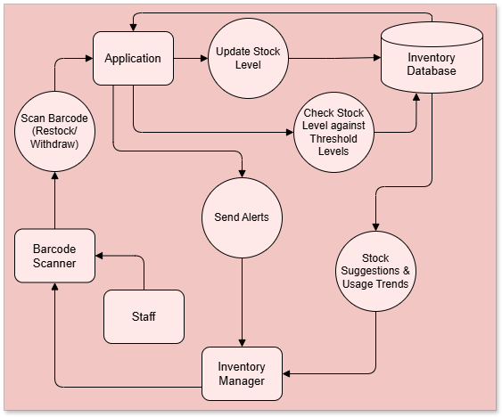

### Use Case Diagram

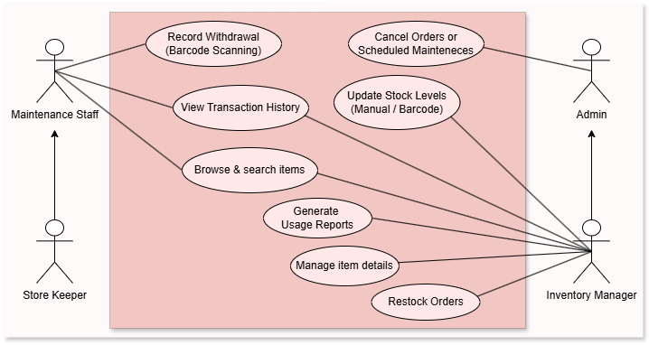

### Entity Relationship Diagram

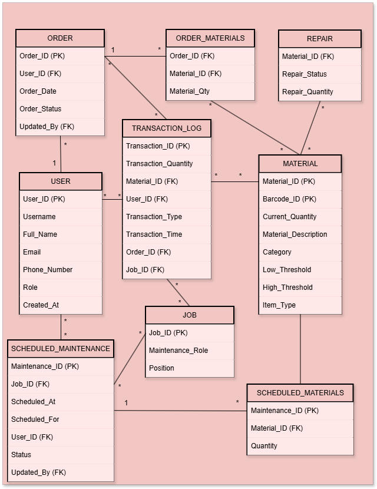

### Database Design Diagram

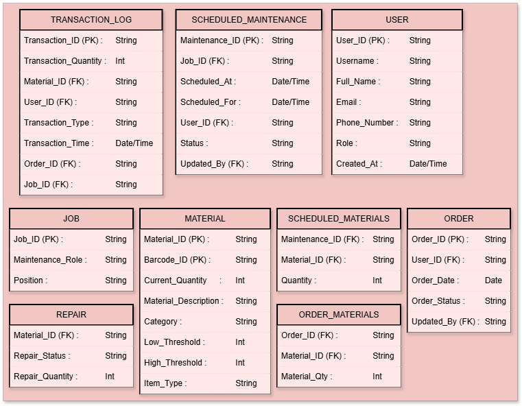

## Screenshots

The screenshots below highlight the main application workflows and user experience.

| Login | Home | Inventory |
| --- | --- | --- |
| 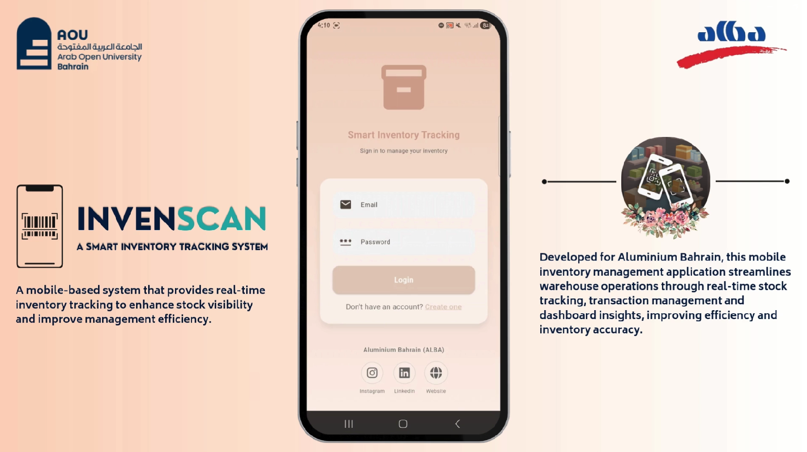 | 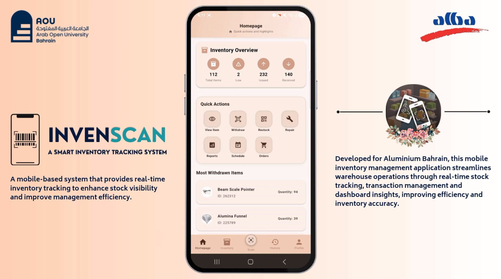 | 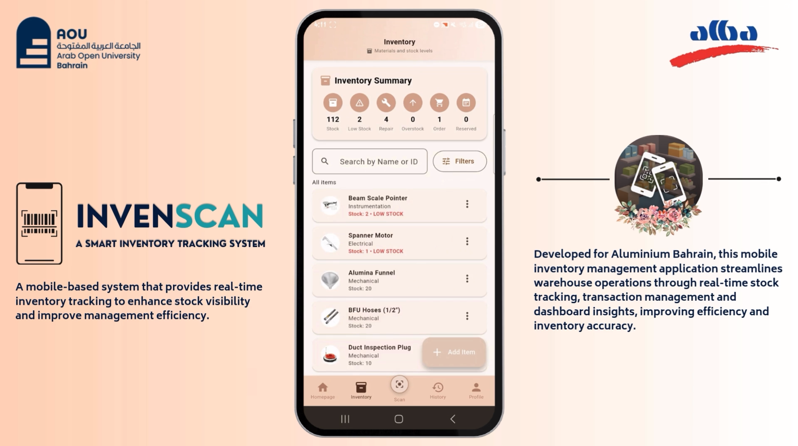 |

| Item Details | Barcode Scanner | Orders |
| --- | --- | --- |
| 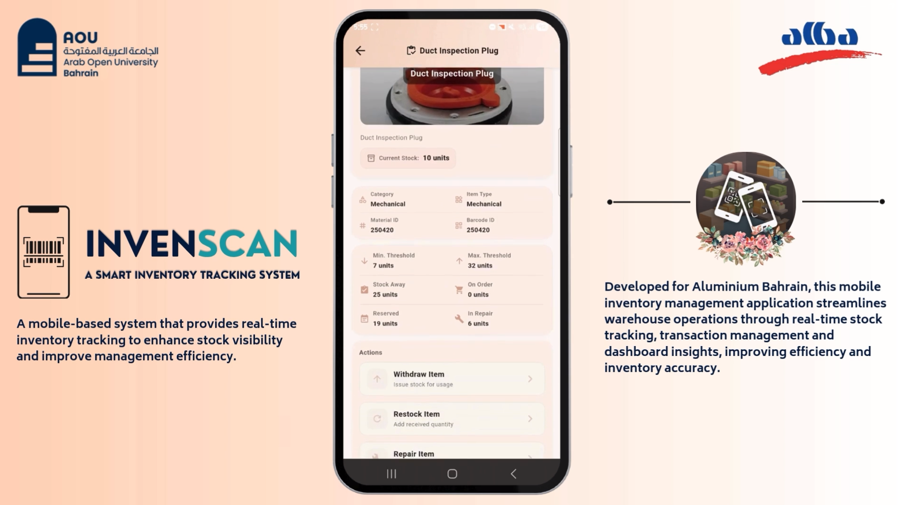 | 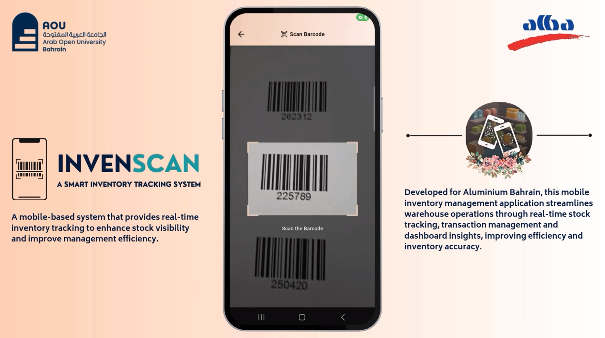 | 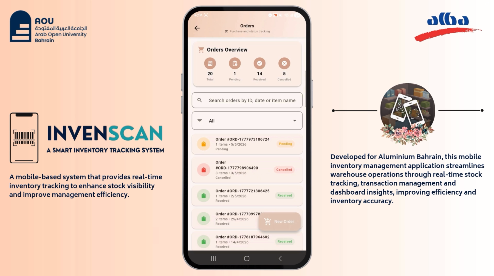 |

| Reports | Transactions | Low Stock Alert |
| --- | --- | --- |
| 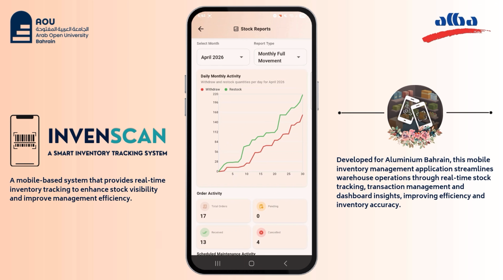 | 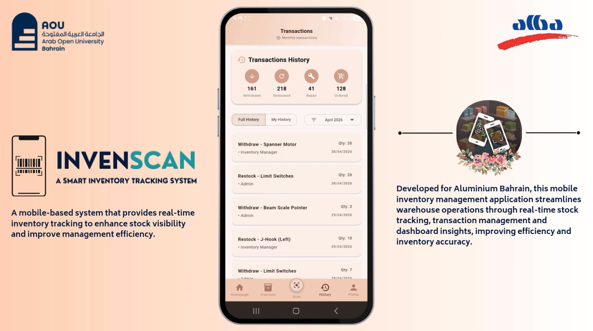 | 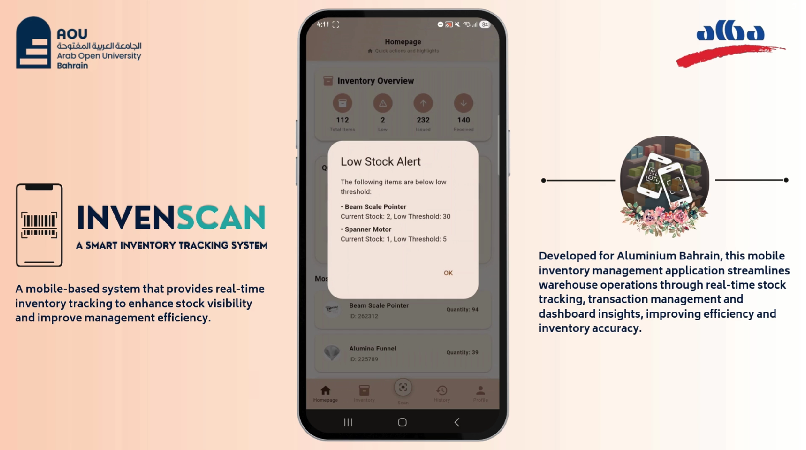 |

Additional visual assets are available in the `screenshots/` folder.

## Project Documentation

- [Project Poster (PNG Preview)](./poster/Smart_Inventory_Tracking_Poster.png)
- [Project Poster (PDF)](./poster/Smart_Inventory_Tracking_Poster.pdf)
- [Presentation Part 1](./presentation/Smart_Inventory_Tracking_Presentation_Part_1.pdf)
- [Presentation Part 2](./presentation/Smart_Inventory_Tracking_Presentation_Part_2.pdf)
- [Demonstration Video](./videos/Smart_Inventory_Tracking_Demo.mp4)

The full project demonstration video is available in the videos folder.

### Workflow Diagrams

- [Withdrawal Workflow Diagram](./docs/workflows/Withdrawal_Workflow_Diagram.png)
- [Repair Workflow Diagram](./docs/workflows/Repair_Workflow_Diagram.png)
- [Ordering Workflow Diagram](./docs/workflows/Ordering_Workflow_Diagram.png)
- [Restocking Workflow Diagram](./docs/workflows/Restocking_Workflow_Diagram.png)
- [Inventory State Diagram](./docs/workflows/Inventory_State_Diagram.png)

## Results & Benefits

The project delivers a practical inventory management experience tailored to maintenance operations. It improves lookup speed, reduces manual stock errors and gives staff a clearer view of inventory movement through dashboards and transaction logs.

Operational benefits include:

- faster item identification with barcode scanning
- more accurate stock tracking through real-time updates
- better control over low-stock and overstock situations
- improved accountability through audit-ready transaction history
- clearer reporting for planning, maintenance review and stock decisions

## Future Enhancements

- Support for multiple stores or warehouse locations
- Offline support for inventory operations
- Smarter forecasting using historical stock movement patterns
- Deeper supplier and ordering integration
- Expanded reporting and KPI dashboards
- Additional workflow automation for maintenance operations

## Source Code Notice

Source code is not publicly available as the project was developed in collaboration with Aluminium Bahrain (ALBA). This repository serves as a project showcase containing documentation, screenshots and project artifacts.

## Acknowledgements

This project was completed as part of the Bachelor of Science in Information Technology and Computing at Arab Open University, Bahrain.

Special thanks to Aluminium Bahrain (ALBA) for providing the project opportunity and industry collaboration throughout the development process.
